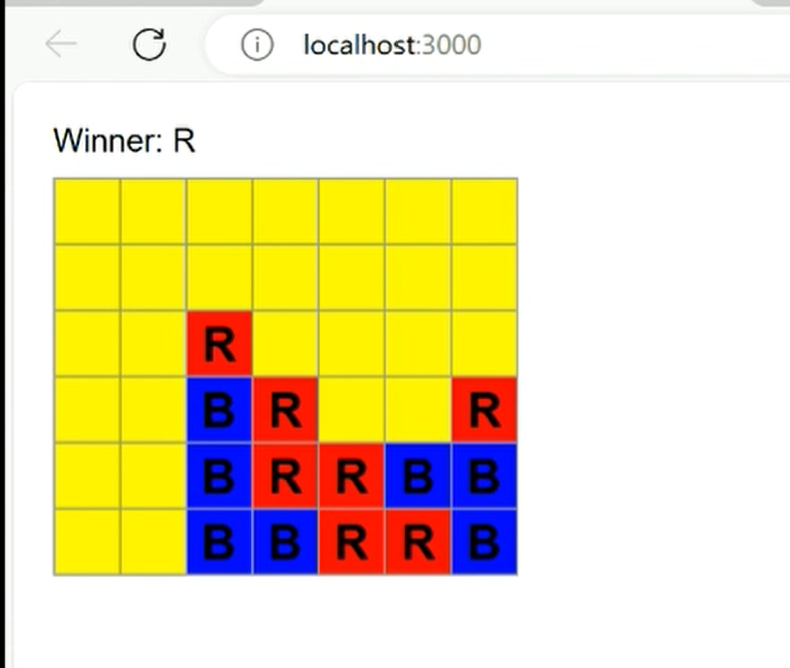
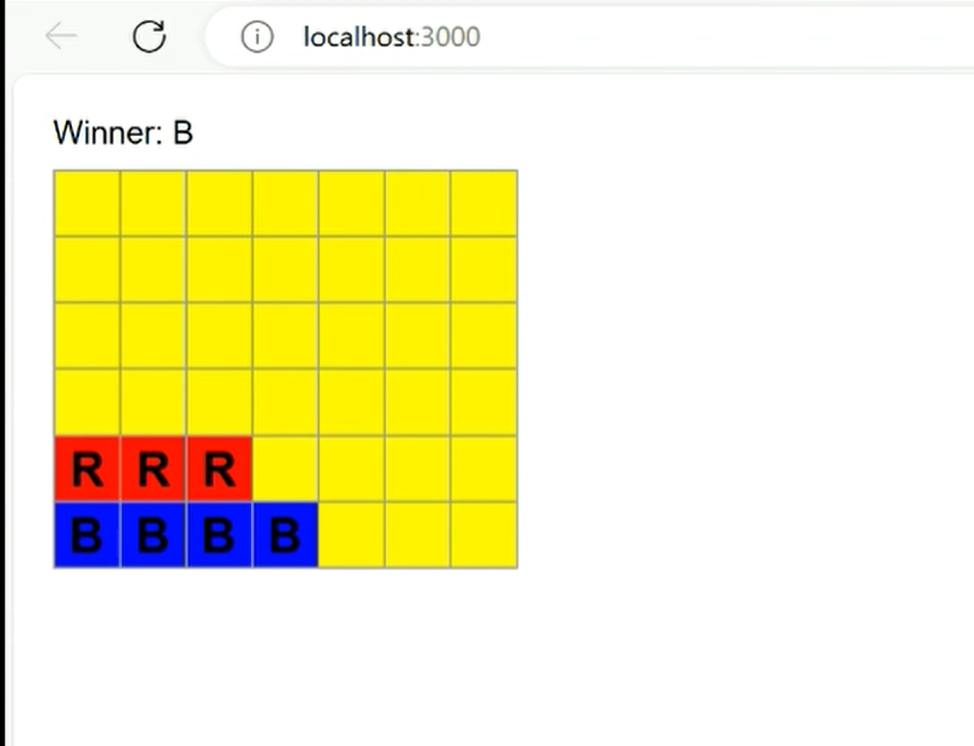
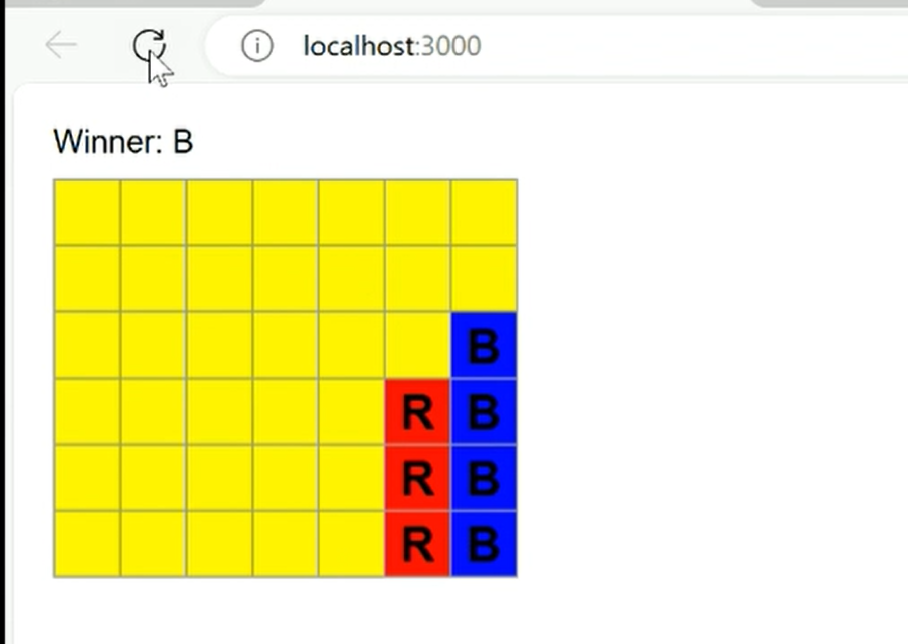
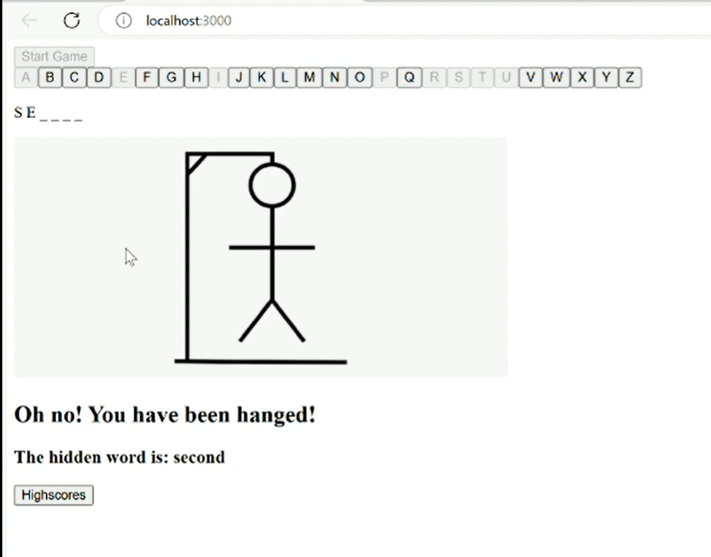
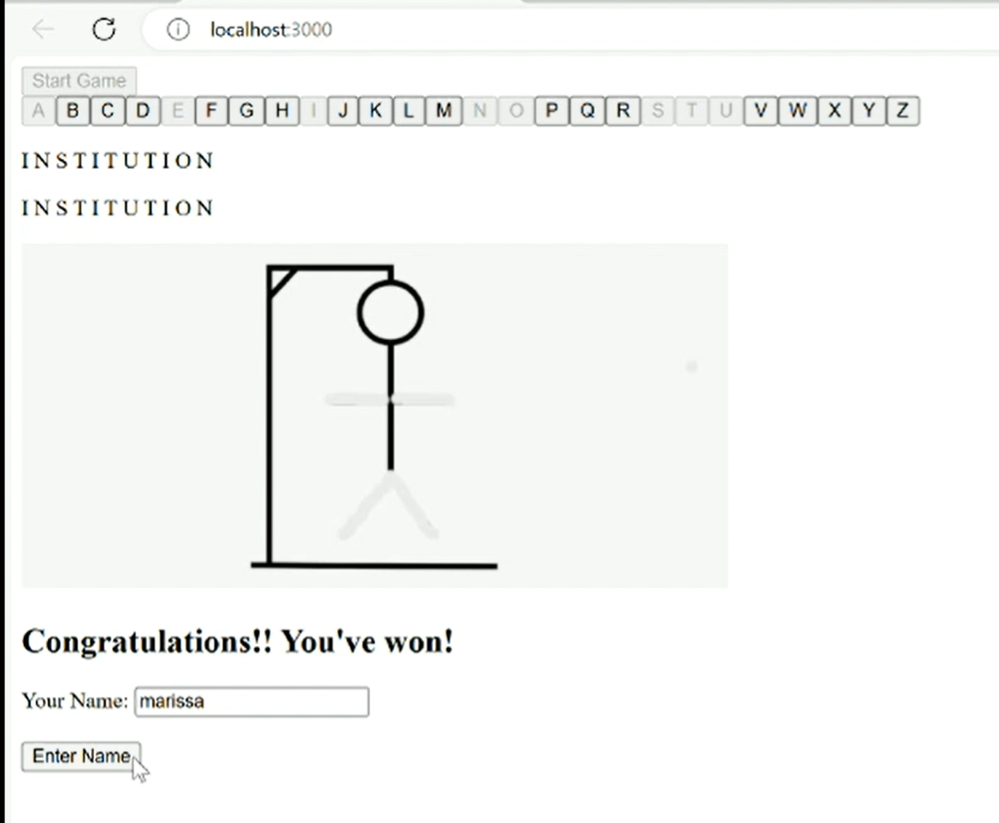
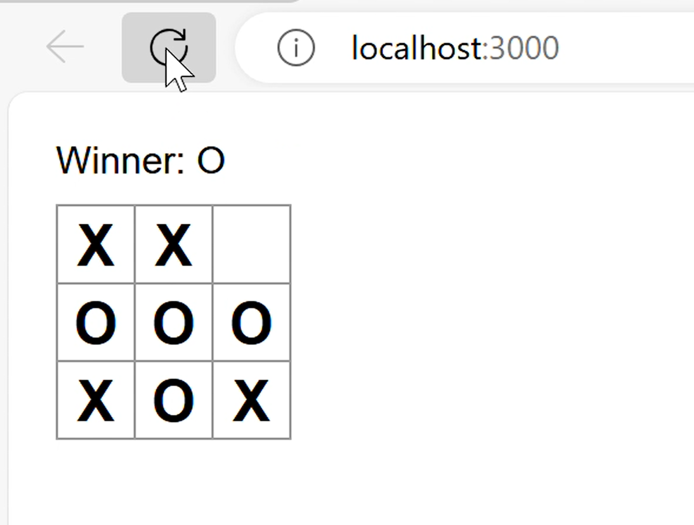
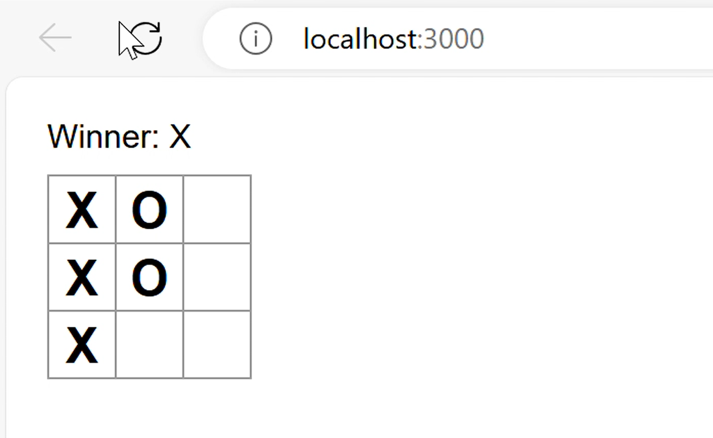

# marissamann.github.io
Portfolio

--------------
AccountTracker
--------------

This Account Tracker Project uses Express, Node, Javascript, MongoDatabase and React technologies.
The site allows a user to register, login, and retrieve information such as balances on seperate pages.
All permissions are checked to ensure secure access.
	One challenge I faced with this project was transferring information through json from the backend to the frontend.
	I struggled to provided json object responses fron Express to React until I researched status codes.
	Passing status codes as responses inside of my backend routes helped me to evaluate data through my react frontend.
I completed this whole project alone.
	My contibutions include the express backend routes getting, adding, updating and deleting records featuring specific account information.
A link to that code's folder in the repo.
	https://github.com/marissamann/AccountTracker.git

----------
BankingApp
----------

This Banking App Project uses Express, Node, Javascript, MongoDatabase and React technologies.
This app allows for three types of users (Administrators, Employees, and Customers).
Customers can login, make deposits/woithdrawls, view their own balances, and view their own transaction histories.
Employees can perform transactions for any user and view any balance/transaction information. They can also register new users.
Administrators can perform transactions for any user, view any balance/transaction information, register new users, and change account types.
	One challenge I faced with this project was tracking sessions within the express backend session.js routes
	I learned that the session variables are consistent among all web pages to carry data between different areas of the banking website.
I completed this project within a group of three.
	My contibutions include all frontend and backend aspects of the registration and login pages.
	I also implemented a lot of css, added logout functionality to all other pages, wrote almost all session logic, and completed all final touches.
A link to that code's folder in the repo.
	https://github.com/marissamann/BankingApp.git

----------------
ConnectToExpress
----------------
Verify connection from Express to Browser.

----------
FourInARow
----------

This Four in a Row Game Project uses Express, Node, Javascript, MongoDatabase and React technologies.
User takes turns dropping red or blue tokens into a game board, the first user to get four tokens in a row wins.
	One challenge I faced with this project was looping through the rows and columns correctly to identify diagonal four-in-a-row wins.
	I struggled to reach the right side of the board until I diagrammed my looping process.
	I learned that psuedocode and diagrams are key to understanding logic before writing code.
I completed this project alone and all contributions are my own.
	I wrote all frontend logic to evaluate wins on the four-in-a-row board.
A link to that code's folder in the repo.
	https://github.com/marissamann/FourInARow.git

-------
Hangman
-------

This Hangman game Project uses Express, Node, Javascript, MongoDatabase and React technologies.
The user is provided a word to guess, every wrong guess adds to the hanging man stick figure.
If the user guesses the word correctly before the man is hung, they win and can view a list of high scores.
	One challenge I faced with this project was showing the progress of the hanging man image
	I decided to use multiple images to change depending on the user's guess.
	These images revolve in the frontend using variables to track which image number comes next.
I completed this project in a group of three.
	My contributions include the hangman images and UI of the general game page.
	I also wrote the logic to track the user's guesses and maintain the status of the word being guessed.
A link to that code's folder in the repo.
	https://github.com/marissamann/Hangman.git

-----------
HellowWorld
-----------
Simple node.js file to display hello world to browser.

--------------
MongoDBExample
--------------
Simple connections to mongodb.

---------
TicTacToe
---------

This Tic-tac-toe game Project uses Express, Node, Javascript, MongoDatabase and React technologies.
User takes turns inputting X or O, first to get three in a row wins.
Otherwise there is a tie.
	One challenge I faced with this project was updating the UI with the appropriate value (X/O).
	I solved this problem by tracking the turns with state variables in React.
I completed this project on my own.
	My contributions were the entire frontend visuals and the game logic.
A link to that code's folder in the repo.
	https://github.com/marissamann/TicTacToe.git

-------
WebForm
-------
Uses Express and Node.js to display a simple form and allows the user to submit input.
