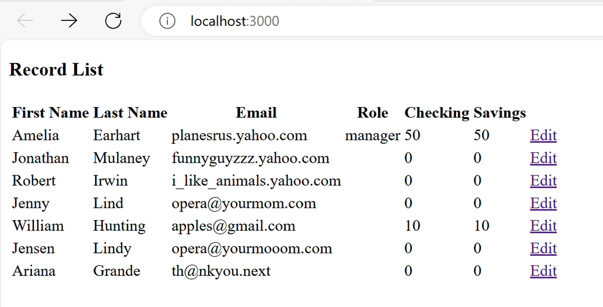
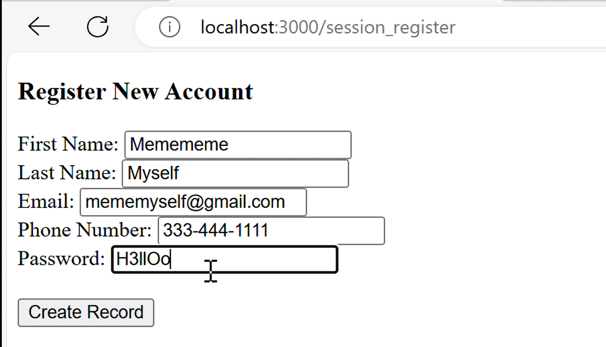
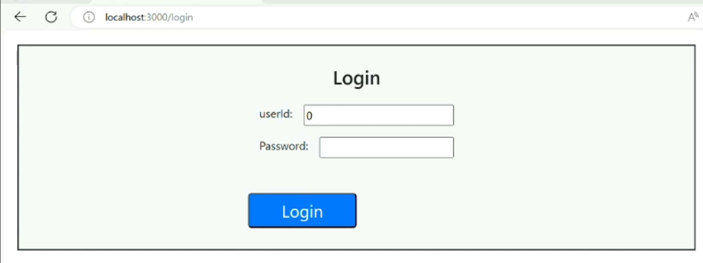
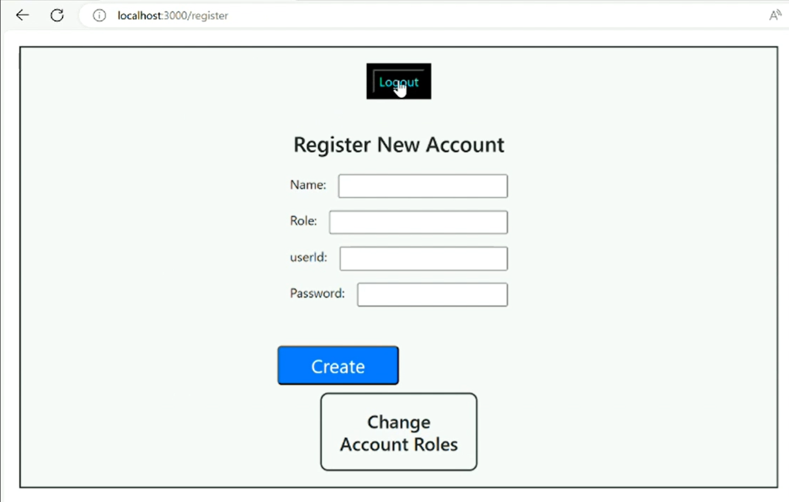

# marissamann.github.io
Portfolio

--------------
AccountTracker
--------------

This Account Tracker Project uses Express, Node, Javascript, MongoDatabase and React technologies.
	One challenge I faced with this project was transferring information through json from the backend to the frontend.
	I struggled to provided json object responses fron Express to React until I researched status codes.
	Passing status codes as responses inside of my backend routes helped me to evaluate data through my react frontend.
I completed this whole project alone.
	My contibutions include the express backend routes getting, adding, updating and deleting records featuring specific account information.
A link to that code's folder in the repo.
	https://github.com/marissamann/AccountTracker.git

----------
BankingApp
----------

This Banking App Project uses Express, Node, Javascript, MongoDatabase and React technologies.
	One challenge I faced with this project was tracking sessions within the express backend session.js routes
	I learned that the session variables are consistent among all web pages to carry data between different areas of the banking website.
I completed this project within a group of three.
	My contibutions include all frontend and backend aspects of the registration and login pages.
	I also implemented a lot of css, added logout functionality to all other pages, wrote almost all session logic, and completed all final touches.
A link to that code's folder in the repo.
	https://github.com/marissamann/BankingApp.git